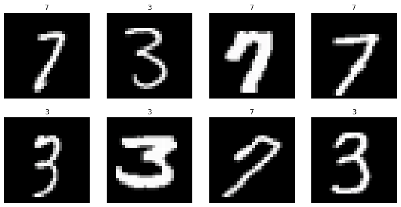
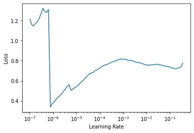
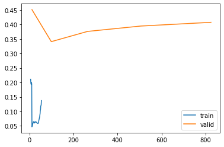
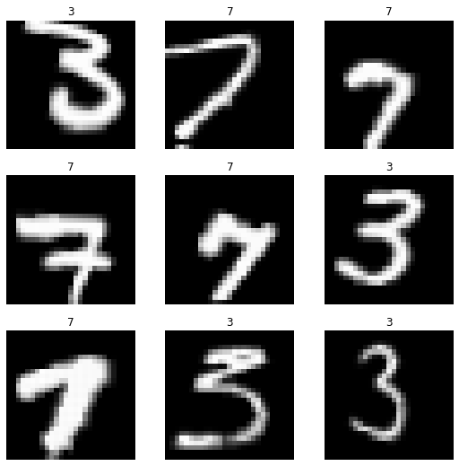
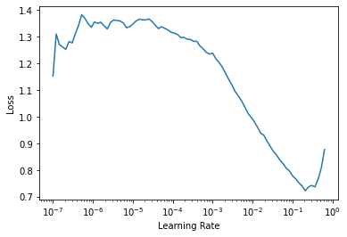
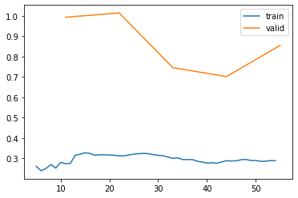

# FastAI XLA Extensions Library
> The FastAI XLA Extensions library package allows your fastai/Pytorch models to run on TPUs using the Pytorch-XLA library.


<a href="https://colab.research.google.com/github/butchland/fastai_xla_extensions/blob/master/nbs/index.ipynb" target="_parent"></a>

## Documentation Site

You can view the documentation here: https://butchland.github.io/fastai_xla_extensions 

## Install

`pip install fastai_xla_extensions`

## How to use

### Configure TPU Environment Access

The Pytorch XLA package requires an environment supporting TPUs (Kaggle kernels, GCP or Colab environments required). 

Nominally, Pytorch XLA also supports  GPUs so please see the [Pytorch XLA site for more instructions](https://pytorch.org/xla/release/1.7/index.html).

If running on Colab, make sure the Runtime Type is set to TPU.


### Install pytorch 1.7.1

Use pytorch 1.7.1 as this is latest version of pytorch supported by the fastai package

```python
#hide_output
#colab
# install pytorch 1.7.1 b/c fastai doesn't support pytorch 1.8 just yet
!pip install -Uqq --no-cache-dir torch==1.7.1+cu101 torchvision==0.8.2+cu101 torchtext==0.8.0 -f https://download.pytorch.org/whl/torch_stable.html

```

### Install fastai

Use the latest fastai and fastcore versions

```python
#hide_output
#colab
!pip install -Uqq fastcore --upgrade
!pip install -Uqq fastai --upgrade
```

### Install Pytorch XLA


This is the official way to install Pytorch-XLA 1.7 as per the [instructions here](https://colab.research.google.com/github/pytorch/xla/blob/master/contrib/colab/getting-started.ipynb#scrollTo=CHzziBW5AoZH)

```python
#hide_output
#colab
!pip install -Uqq cloud-tpu-client==0.10 https://storage.googleapis.com/tpu-pytorch/wheels/torch_xla-1.7-cp37-cp37m-linux_x86_64.whl
```

### Check if XLA is available

```python
#colab
import warnings
try:
    import torch_xla
except ImportError as e:
    if DEBUG: warnings.warn('TPU environment not available')
    
```

    WARNING:root:Waiting for TPU to be start up with version pytorch-1.7...
    WARNING:root:Waiting for TPU to be start up with version pytorch-1.7...
    WARNING:root:TPU has started up successfully with version pytorch-1.7


### Import the libraries
Import the fastai and fastai_xla_extensions libraries

```python
from fastai.vision.all import *
```

```python
#colab
#hide_output
from fastai_xla_extensions.all import *
```


## Single and Multi Core TPU Modes

The `fastai_xla_extensions` package allows you to train your models using either a single TPU core or multiple TPU cores. 

Using multi TPU cores is usually faster than single TPU core, but due to some limitations, not all fastai features are supported in multi TPU core mode.

* **Multi Core TPU mode**

    In order to run in multi TPU core mode, the `fastai_xla_extensions` package patched some additional methods to the `Learner` class.
    
    These additional methods are all prefixed by `xla`. For example, to run the `Learner.fit` method in multi core tpu mode, you can invoke the equivalent `Learner.xla_fit` method, with almost the same parameters.
    
    
   Note that in multi core TPU mode, when calling normal learner or data loader methods (not prefixed by `xla`), the process does not use the multi core TPUs, but instead runs them using the CPU.
  
  * **List of `xla` prefixed methods**
  
    * xla_fit
    * xla_fine_tune
    * xla_fit_one_cycle
    * xla_fit_sgdr
    * xla_fit_flat_cos
    * xla_lr_find
    * xla_get_preds
    
    
  * **Additional `xla` Parameters (for Multi Core TPU mode)**

    All `xla` prefixed methods support the following additional parameters:
    
    * num_cores: this is defaulted to 8 (representing the number of TPU cores per TPU device) - valid values are `8` or `1` on Google Colab. For running GCP TPUs, other values maybe possible. See the [Pytorch XLA page](https://pytorch.org/xla/release/1.7/index.html) for more details.
    
    * start_method: this is defaulted to `fork` which the only value supported on Google Colab. On GCP, other values supported include `spawn`. Again, see the [Pytorch XLA page](https://pytorch.org/xla/release/1.7/index.html) for more details.
    
    * master_cbs: these are callbacks that are run only on the master ordinal process (rank = 0). This allows the addition of callbacks that may interfere with each other if run simultaneously on more than one process by restricting them to run on only one process - the master ordinal process.
    
    
* **Single Core TPU mode**

    In order to run in single TPU core mode, the `fastai_xla_extensions` package added a method `to_xla` to the `Learner` class.
    
    After invoking this method, the learner will now use an associated TPU core device to the learner process which will be used when training the model.
    
    This means we can use the same `fit` methods in `Learner` that we normally use to train the model when using a GPU or a CPU.
    
    Also note that the single TPU core mode is incompatible with the Multi TPU Core mode, and that the kernel will have to restarted once the single TPU core mode is set. This is because once a TPU core is associated with the main process, it cannot be unset without restarting the kernel.
 


### Multi TPU Core Example
Build a MNIST classifier -- adapted from fastai course [Lesson 4 notebook](https://github.com/fastai/course-v4/blob/master/nbs/04_mnist_basics.ipynb)

Load MNIST dataset 

```python
path = untar_data(URLs.MNIST_TINY)
```


Create Fastai DataBlock


```python
datablock = DataBlock(
    blocks=(ImageBlock,CategoryBlock),
    get_items=get_image_files,
    splitter=GrandparentSplitter(),
    get_y=parent_label,
    item_tfms=Resize(28),
    # batch transforms run on the CPU and are slow, so only using the Normalize batch transform
    batch_tfms=[Normalize.from_stats(*imagenet_stats)]
)
```

```python
#colab
datablock.summary(path)
```

    Setting-up type transforms pipelines
    Collecting items from /root/.fastai/data/mnist_tiny
    Found 1428 items
    2 datasets of sizes 709,699
    Setting up Pipeline: PILBase.create
    Setting up Pipeline: parent_label -> Categorize -- {'vocab': None, 'sort': True, 'add_na': False}
    
    Building one sample
      Pipeline: PILBase.create
        starting from
          /root/.fastai/data/mnist_tiny/train/7/8791.png
        applying PILBase.create gives
          PILImage mode=RGB size=28x28
      Pipeline: parent_label -> Categorize -- {'vocab': None, 'sort': True, 'add_na': False}
        starting from
          /root/.fastai/data/mnist_tiny/train/7/8791.png
        applying parent_label gives
          7
        applying Categorize -- {'vocab': None, 'sort': True, 'add_na': False} gives
          TensorCategory(1)
    
    Final sample: (PILImage mode=RGB size=28x28, TensorCategory(1))
    
    
    Collecting items from /root/.fastai/data/mnist_tiny
    Found 1428 items
    2 datasets of sizes 709,699
    Setting up Pipeline: PILBase.create
    Setting up Pipeline: parent_label -> Categorize -- {'vocab': None, 'sort': True, 'add_na': False}
    Setting up after_item: Pipeline: Resize -- {'size': (28, 28), 'method': 'crop', 'pad_mode': 'reflection', 'resamples': (2, 0), 'p': 1.0} -> ToTensor
    Setting up before_batch: Pipeline: 
    Setting up after_batch: Pipeline: IntToFloatTensor -- {'div': 255.0, 'div_mask': 1} -> Normalize -- {'mean': tensor([[[[0.4850]],
    
             [[0.4560]],
    
             [[0.4060]]]]), 'std': tensor([[[[0.2290]],
    
             [[0.2240]],
    
             [[0.2250]]]]), 'axes': (0, 2, 3)}
    
    Building one batch
    Applying item_tfms to the first sample:
      Pipeline: Resize -- {'size': (28, 28), 'method': 'crop', 'pad_mode': 'reflection', 'resamples': (2, 0), 'p': 1.0} -> ToTensor
        starting from
          (PILImage mode=RGB size=28x28, TensorCategory(1))
        applying Resize -- {'size': (28, 28), 'method': 'crop', 'pad_mode': 'reflection', 'resamples': (2, 0), 'p': 1.0} gives
          (PILImage mode=RGB size=28x28, TensorCategory(1))
        applying ToTensor gives
          (TensorImage of size 3x28x28, TensorCategory(1))
    
    Adding the next 3 samples
    
    No before_batch transform to apply
    
    Collating items in a batch
    
    Applying batch_tfms to the batch built
      Pipeline: IntToFloatTensor -- {'div': 255.0, 'div_mask': 1} -> Normalize -- {'mean': tensor([[[[0.4850]],
    
             [[0.4560]],
    
             [[0.4060]]]]), 'std': tensor([[[[0.2290]],
    
             [[0.2240]],
    
             [[0.2250]]]]), 'axes': (0, 2, 3)}
        starting from
          (TensorImage of size 4x3x28x28, TensorCategory([1, 1, 1, 1]))
        applying IntToFloatTensor -- {'div': 255.0, 'div_mask': 1} gives
          (TensorImage of size 4x3x28x28, TensorCategory([1, 1, 1, 1]))
        applying Normalize -- {'mean': tensor([[[[0.4850]],
    
             [[0.4560]],
    
             [[0.4060]]]]), 'std': tensor([[[[0.2290]],
    
             [[0.2240]],
    
             [[0.2250]]]]), 'axes': (0, 2, 3)} gives
          (TensorImage of size 4x3x28x28, TensorCategory([1, 1, 1, 1]))


Create the dataloader

```python
dls = datablock.dataloaders(path, bs=8) # use a small batch size as mnist_tiny dataset is very small
```

```python
#colab
dls.show_batch()
```





Create a Fastai CNN Learner


```python
learner = cnn_learner(dls, resnet18, metrics=accuracy, concat_pool=False) # fastai AdaptivePooling causes a lowering which slows down the training so using nn.AvgPool2D
                      
```

    Downloading: "https://download.pytorch.org/models/resnet18-5c106cde.pth" to /root/.cache/torch/hub/checkpoints/resnet18-5c106cde.pth


    


```python
#colab
learner.summary()
```

Using the `lr_find` works 

```python
#colab
learner.xla_lr_find()
```

    start fit


    SuggestedLRs(lr_min=7.585775847473997e-08, lr_steep=6.309573450380412e-07)





Run one cycle training.


```python
#colab
learner.xla_fit_one_cycle(5,lr_max=slice(1e-4,0.02))
```

    start fit


<table border="1" class="dataframe">
  <thead>
    <tr style="text-align: left;">
      <th>epoch</th>
      <th>train_loss</th>
      <th>valid_loss</th>
      <th>accuracy</th>
      <th>time</th>
    </tr>
  </thead>
  <tbody>
    <tr>
      <td>0</td>
      <td>0.190064</td>
      <td>0.391755</td>
      <td>0.848011</td>
      <td>00:17</td>
    </tr>
    <tr>
      <td>1</td>
      <td>0.273210</td>
      <td>0.288629</td>
      <td>0.882102</td>
      <td>00:06</td>
    </tr>
    <tr>
      <td>2</td>
      <td>0.322163</td>
      <td>0.430995</td>
      <td>0.875000</td>
      <td>00:06</td>
    </tr>
    <tr>
      <td>3</td>
      <td>0.354422</td>
      <td>0.534526</td>
      <td>0.830966</td>
      <td>00:06</td>
    </tr>
    <tr>
      <td>4</td>
      <td>0.372328</td>
      <td>0.517053</td>
      <td>0.833807</td>
      <td>00:06</td>
    </tr>
  </tbody>
</table>


Further fine-tuning

```python
#colab
learner.xla_fit_one_cycle(5,lr_max=slice(7e-4, 1e-3))
```

    start fit


<table border="1" class="dataframe">
  <thead>
    <tr style="text-align: left;">
      <th>epoch</th>
      <th>train_loss</th>
      <th>valid_loss</th>
      <th>accuracy</th>
      <th>time</th>
    </tr>
  </thead>
  <tbody>
    <tr>
      <td>0</td>
      <td>0.046700</td>
      <td>0.451159</td>
      <td>0.867898</td>
      <td>00:14</td>
    </tr>
    <tr>
      <td>1</td>
      <td>0.056459</td>
      <td>0.340751</td>
      <td>0.896307</td>
      <td>00:07</td>
    </tr>
    <tr>
      <td>2</td>
      <td>0.061811</td>
      <td>0.376011</td>
      <td>0.892045</td>
      <td>00:06</td>
    </tr>
    <tr>
      <td>3</td>
      <td>0.071214</td>
      <td>0.394541</td>
      <td>0.879261</td>
      <td>00:06</td>
    </tr>
    <tr>
      <td>4</td>
      <td>0.137522</td>
      <td>0.407396</td>
      <td>0.899148</td>
      <td>00:06</td>
    </tr>
  </tbody>
</table>


Model params are using CPU (since it is the spawned process models that are moved to TPU)

```python
#colab
one_param(learner.model).device
```


    device(type='cpu')


Plot loss seems to be working fine.

```python
#colab
learner.recorder.plot_loss()
```





### Single TPU Core Example
Build a MNIST classifier -- adapted from fastai course [Lesson 4 notebook](https://github.com/fastai/course-v4/blob/master/nbs/04_mnist_basics.ipynb)

Load MNIST dataset 

```python
path = untar_data(URLs.MNIST_TINY)
```

Create Fastai DataBlock


```python
datablock = DataBlock(
    blocks=(ImageBlock,CategoryBlock),
    get_items=get_image_files,
    splitter=GrandparentSplitter(),
    get_y=parent_label,
    item_tfms=Resize(28),
    # affine transforms are performed on the CPU, other batch transforms are done on the TPU
    batch_tfms=aug_transforms(do_flip=False,min_scale=0.8)
)
```

```python
#colab
datablock.summary(path)
```

    Setting-up type transforms pipelines
    Collecting items from /root/.fastai/data/mnist_tiny
    Found 1428 items
    2 datasets of sizes 709,699
    Setting up Pipeline: PILBase.create
    Setting up Pipeline: parent_label -> Categorize -- {'vocab': None, 'sort': True, 'add_na': False}
    
    Building one sample
      Pipeline: PILBase.create
        starting from
          /root/.fastai/data/mnist_tiny/train/7/8791.png
        applying PILBase.create gives
          PILImage mode=RGB size=28x28
      Pipeline: parent_label -> Categorize -- {'vocab': None, 'sort': True, 'add_na': False}
        starting from
          /root/.fastai/data/mnist_tiny/train/7/8791.png
        applying parent_label gives
          7
        applying Categorize -- {'vocab': None, 'sort': True, 'add_na': False} gives
          TensorCategory(1)
    
    Final sample: (PILImage mode=RGB size=28x28, TensorCategory(1))
    
    
    Collecting items from /root/.fastai/data/mnist_tiny
    Found 1428 items
    2 datasets of sizes 709,699
    Setting up Pipeline: PILBase.create
    Setting up Pipeline: parent_label -> Categorize -- {'vocab': None, 'sort': True, 'add_na': False}
    Setting up after_item: Pipeline: Resize -- {'size': (28, 28), 'method': 'crop', 'pad_mode': 'reflection', 'resamples': (2, 0), 'p': 1.0} -> ToTensor
    Setting up before_batch: Pipeline: 
    Setting up after_batch: Pipeline: IntToFloatTensor -- {'div': 255.0, 'div_mask': 1} -> Warp -- {'magnitude': 0.2, 'p': 1.0, 'draw_x': None, 'draw_y': None, 'size': None, 'mode': 'bilinear', 'pad_mode': 'reflection', 'batch': False, 'align_corners': True, 'mode_mask': 'nearest'} -> RandomResizedCropGPU -- {'size': None, 'min_scale': 0.8, 'ratio': (1, 1), 'mode': 'bilinear', 'valid_scale': 1.0, 'p': 1.0} -> Brightness -- {'max_lighting': 0.2, 'p': 1.0, 'draw': None, 'batch': False}
    
    Building one batch
    Applying item_tfms to the first sample:
      Pipeline: Resize -- {'size': (28, 28), 'method': 'crop', 'pad_mode': 'reflection', 'resamples': (2, 0), 'p': 1.0} -> ToTensor
        starting from
          (PILImage mode=RGB size=28x28, TensorCategory(1))
        applying Resize -- {'size': (28, 28), 'method': 'crop', 'pad_mode': 'reflection', 'resamples': (2, 0), 'p': 1.0} gives
          (PILImage mode=RGB size=28x28, TensorCategory(1))
        applying ToTensor gives
          (TensorImage of size 3x28x28, TensorCategory(1))
    
    Adding the next 3 samples
    
    No before_batch transform to apply
    
    Collating items in a batch
    
    Applying batch_tfms to the batch built
      Pipeline: IntToFloatTensor -- {'div': 255.0, 'div_mask': 1} -> Warp -- {'magnitude': 0.2, 'p': 1.0, 'draw_x': None, 'draw_y': None, 'size': None, 'mode': 'bilinear', 'pad_mode': 'reflection', 'batch': False, 'align_corners': True, 'mode_mask': 'nearest'} -> RandomResizedCropGPU -- {'size': None, 'min_scale': 0.8, 'ratio': (1, 1), 'mode': 'bilinear', 'valid_scale': 1.0, 'p': 1.0} -> Brightness -- {'max_lighting': 0.2, 'p': 1.0, 'draw': None, 'batch': False}
        starting from
          (TensorImage of size 4x3x28x28, TensorCategory([1, 1, 1, 1]))
        applying IntToFloatTensor -- {'div': 255.0, 'div_mask': 1} gives
          (TensorImage of size 4x3x28x28, TensorCategory([1, 1, 1, 1]))
        applying Warp -- {'magnitude': 0.2, 'p': 1.0, 'draw_x': None, 'draw_y': None, 'size': None, 'mode': 'bilinear', 'pad_mode': 'reflection', 'batch': False, 'align_corners': True, 'mode_mask': 'nearest'} gives
          (TensorImage of size 4x3x28x28, TensorCategory([1, 1, 1, 1]))
        applying RandomResizedCropGPU -- {'size': None, 'min_scale': 0.8, 'ratio': (1, 1), 'mode': 'bilinear', 'valid_scale': 1.0, 'p': 1.0} gives
          (TensorImage of size 4x3x26x26, TensorCategory([1, 1, 1, 1]))
        applying Brightness -- {'max_lighting': 0.2, 'p': 1.0, 'draw': None, 'batch': False} gives
          (TensorImage of size 4x3x26x26, TensorCategory([1, 1, 1, 1]))


Create the dataloader

```python
dls = datablock.dataloaders(path)
```

```python
#colab
dls.show_batch()
```





Create a Fastai CNN Learner


```python
learner = cnn_learner(dls, resnet18, metrics=accuracy)
                      
```

```python
#colab
learner.summary()
```

Set Learner to XLA mode
This will setup the learner to use the XLA Device

```python
#colab
learner.to_xla()
```


    <fastai.learner.Learner at 0x7fc75a5a8090>


Using the `lr_find` works 

```python
#colab
learner.lr_find()
```


    SuggestedLRs(lr_min=0.02089296132326126, lr_steep=0.0030199517495930195)





Run one cycle training.


```python
#colab
learner.fit_one_cycle(5,lr_max=slice(1e-4,0.02))
```


<table border="1" class="dataframe">
  <thead>
    <tr style="text-align: left;">
      <th>epoch</th>
      <th>train_loss</th>
      <th>valid_loss</th>
      <th>accuracy</th>
      <th>time</th>
    </tr>
  </thead>
  <tbody>
    <tr>
      <td>0</td>
      <td>0.896238</td>
      <td>1.876374</td>
      <td>0.505007</td>
      <td>00:51</td>
    </tr>
    <tr>
      <td>1</td>
      <td>0.725275</td>
      <td>1.018629</td>
      <td>0.532189</td>
      <td>00:13</td>
    </tr>
    <tr>
      <td>2</td>
      <td>0.614300</td>
      <td>3.292356</td>
      <td>0.513591</td>
      <td>00:03</td>
    </tr>
    <tr>
      <td>3</td>
      <td>0.549166</td>
      <td>2.262487</td>
      <td>0.580830</td>
      <td>00:03</td>
    </tr>
    <tr>
      <td>4</td>
      <td>0.535161</td>
      <td>1.760773</td>
      <td>0.660944</td>
      <td>00:03</td>
    </tr>
  </tbody>
</table>


Further fine-tuning

```python
#colab
learner.fit_one_cycle(5,slice(7e-4, 1e-3))
```


<table border="1" class="dataframe">
  <thead>
    <tr style="text-align: left;">
      <th>epoch</th>
      <th>train_loss</th>
      <th>valid_loss</th>
      <th>accuracy</th>
      <th>time</th>
    </tr>
  </thead>
  <tbody>
    <tr>
      <td>0</td>
      <td>0.280359</td>
      <td>0.992468</td>
      <td>0.688126</td>
      <td>00:12</td>
    </tr>
    <tr>
      <td>1</td>
      <td>0.315132</td>
      <td>1.013533</td>
      <td>0.712446</td>
      <td>00:03</td>
    </tr>
    <tr>
      <td>2</td>
      <td>0.306187</td>
      <td>0.745202</td>
      <td>0.711016</td>
      <td>00:03</td>
    </tr>
    <tr>
      <td>3</td>
      <td>0.282278</td>
      <td>0.701246</td>
      <td>0.736767</td>
      <td>00:03</td>
    </tr>
    <tr>
      <td>4</td>
      <td>0.288474</td>
      <td>0.854370</td>
      <td>0.711016</td>
      <td>00:03</td>
    </tr>
  </tbody>
</table>


Model params are using TPU

```python
#colab
one_param(learner.model).device
```


    device(type='xla', index=1)


Dataloader device is set to None (as it is the device mover transform that moves the input to the TPU)

```python
learner.dls.device is None
```


    True


Plot loss seems to be working fine.

```python
#colab
learner.recorder.plot_loss()
```





## Performance troubleshooting

To check if your model is hiting an `aten operation` (an operation that is not handled by accelerator device and returned to CPU for default implementation) you can check it with ands then you can report to pytorch xla team.

```python
#colab
from fastai_xla_extensions.utils import print_aten_ops

print_aten_ops()
```

    needs lowering: Counter: aten::adaptive_max_pool2d
      Value: 311
    needs lowering: Counter: aten::adaptive_max_pool2d_backward
      Value: 201


## Samples

Other examples of fastai notebooks using the fastai_xla_extensions package are also available here: 

* [Vision (Multiple TPU Core) - CIFAR](https://github.com/butchland/fastai_xla_extensions/blob/master/samples/fastai-multi-core-tpu-training-sample.ipynb) [](https://colab.research.google.com/github/butchland/fastai_xla_extensions/blob/master/samples/fastai-multi-core-tpu-training-sample.ipynb)
* [Vision (Multiple TPU Core) - Multi Label](https://github.com/butchland/fastai_xla_extensions/blob/master/samples/fastai-multi-core-tpu-training-sample2.ipynb) [](https://colab.research.google.com/github/butchland/fastai_xla_extensions/blob/master/samples/fastai-multi-core-tpu-training-sample2.ipynb)

* [Vision (Multiple TPU Core) - Pets](https://github.com/butchland/fastai_xla_extensions/blob/master/samples/test_fast_tpu_pets.ipynb) [](https://colab.research.google.com/github/butchland/fastai_xla_extensions/blob/master/samples/test_fast_tpu_pets.ipynb)

* [Vision (Multiple TPU Core) - Plain pytorch training with minimal fastai](https://github.com/butchland/fastai_xla_extensions/blob/master/samples/minimal_fastai_pytorch_tpu_sample.ipynb) [](https://colab.research.google.com/github/butchland/fastai_xla_extensions/blob/master/samples/minimal_fastai_pytorch_tpu_sample.ipynb)

* [Vision (Single Core TPU)](https://github.com/butchland/fastai_xla_extensions/blob/master/samples/MNIST_TPU_demo.ipynb) [](https://colab.research.google.com/github/butchland/fastai_xla_extensions/blob/master/samples/MNIST_TPU_demo.ipynb)

* [Collaborative Filtering (Single Core TPU)](https://github.com/butchland/fastai_xla_extensions/blob/master/samples/MovieLensCollaborativeFilteringTPU.ipynb) [](https://colab.research.google.com/github/butchland/fastai_xla_extensions/blob/master/samples/MovieLensCollaborativeFilteringTPU.ipynb)

* [Tabular (Single Core TPU)](https://github.com/butchland/fastai_xla_extensions/blob/master/samples/TabularTrainingTPUdemo.ipynb) [](https://colab.research.google.com/github/butchland/fastai_xla_extensions/blob/master/samples/TabularTrainingTPUdemo.ipynb)

* [Kaggle Notebook version of Vision (Multiple TPU Core) - Pets](https://www.kaggle.com/butchland/fastai-multi-core-tpu-pets-sample) 

* **NEW** ** [Vision (Multi Core) using Pytorch Image Models (timm models) with Albumentations](https://github.com/butchland/fastai_xla_extensions/blob/master/samples/timm-albumentations-fastai-multi-tpu-sample.ipynb) [](https://colab.research.google.com/github/butchland/fastai_xla_extensions/blob/master/samples/timm-albumentations-fastai-multi-tpu-sample.ipynb)


More samples will be added in the future as we fix issues and implement more capabilities.


## Status
The fastai XLA extensions library is still in early development phase but is getting close to a 1.0 release.

The Multi Core TPU mode has been well tested on vision tasks (Classification) but the other modules (Tabular, Collab Filtering, and Text) have not.

If you use the package and encounter issues, please file bugs and issues encountered in the project's issue tracker.

Feel free to suggest enhancements or feature requests. (Though they might not necessarily be addressed any time soon).

If you wish to contribute to the project, fork it and make pull request. 

This project uses [nbdev](https://nbdev.fast.ai/) -- a jupyter notebook first development environment and is being developed on [Colab](https://colab.research.google.com).


## Development Setup

see [this note on how to setup your environment for development](https://butchland.github.io/fastai_xla_extensions/dev_setup)
